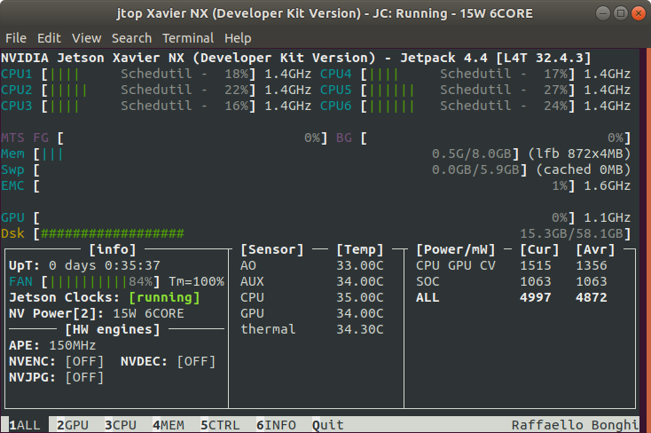

# IDK (몰라요)
2023.7.29 NVIDA Jetson 사용 👍 (with Greendangdang 😎)

# Ubuntu 설치
<hl>
  
  1. https://developer.nvidia.com/embedded/learn/getting-started-jetson 에서 JetSon nano 2GB용 ubuntu 이미지 다운로드
  
  2. 64GB sd카드 포맷
  3. balenEtcher로 sd카드에 flash ⚡

# Jetson 조립하기 🛠
1. 쿨링팬 설치 
2. 키보드와 마우스 연결하기
3. 카메라 설치 및 연결

# Jetson 쿨링팬 돌리기 🔧
: Jetson의 발열이 너무 심해서 쿨링팬이 필요함.

<hl>

cd Download ✏ Download 폴더로 이동

git clone  https://github.com/jetsonworld/jetson-fan-ctl.git ✏ Git 프로젝트 복제

cd jetson-fan-ctl ✏ 복제한 프로젝트 폴더로 이동

sudo sh install.sh ✏ 설치 시작

# Jetson 상태, 메모리 체크를 위한 Python Package 설치 ⚙

sudo apt-get upgrade && update ✏ Ubuntu Package 업데이트 & 업그레이드 

sudo apt-get install python3-pip ✏ pip3 설치

sudo -H pip3 install -U jetson-stats ✏ Package 설치

pip3 list | grep jetson ✏ Package가 설치 되어있는지 확인

<h1>재부팅</h1>

jtop ✏ jtop 실행

# 카메라 체크 📸
git clone https://github.com/jetsonhacks/USB-Camera.git ✏ Camera 복제

cd USB-Camera ✏ USB-Camera 폴더로 이동

python3 usb-camera-gst.py ✏ usb-camera-gst.py 실행
